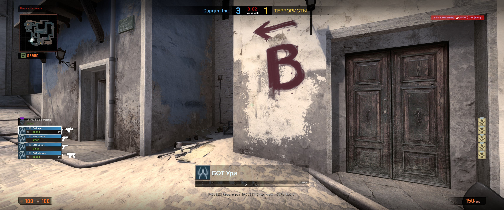
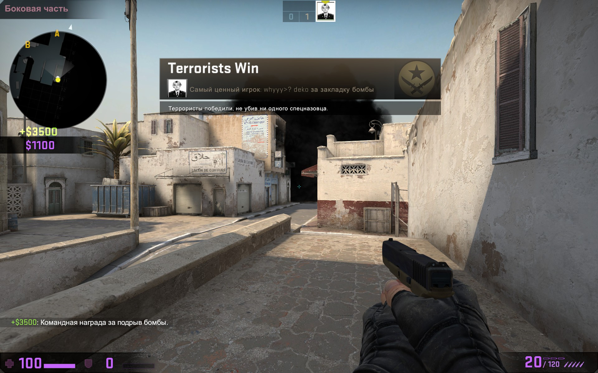
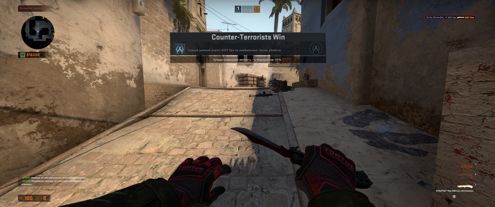
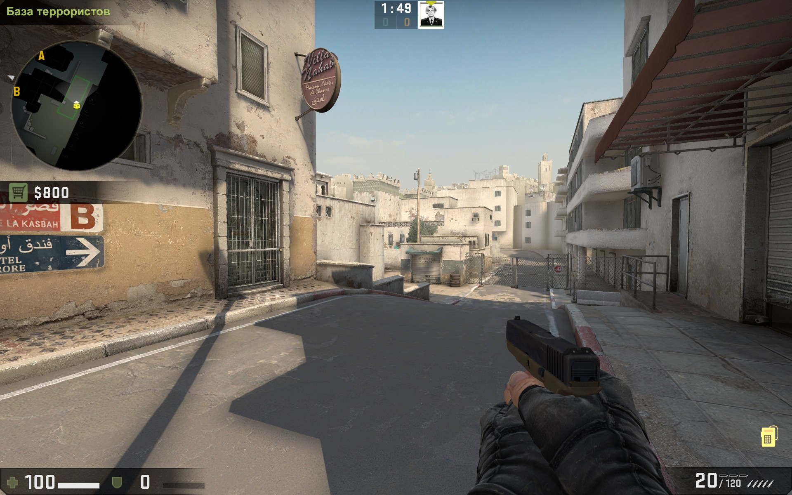
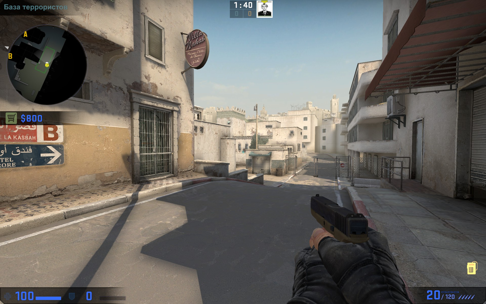
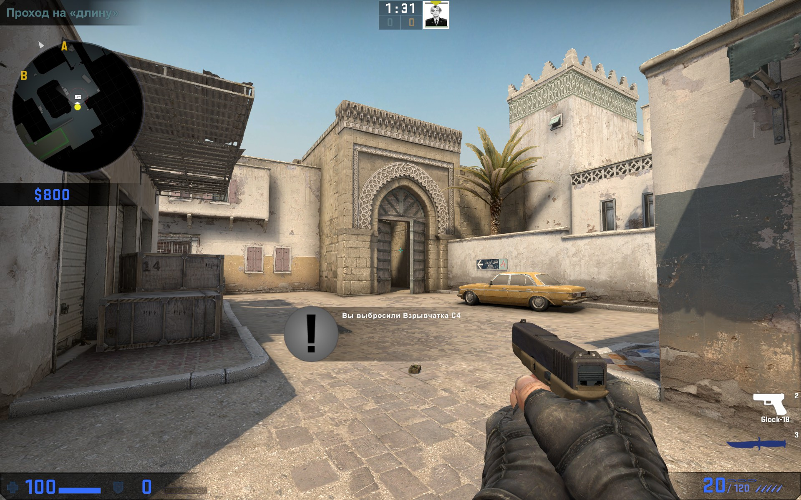
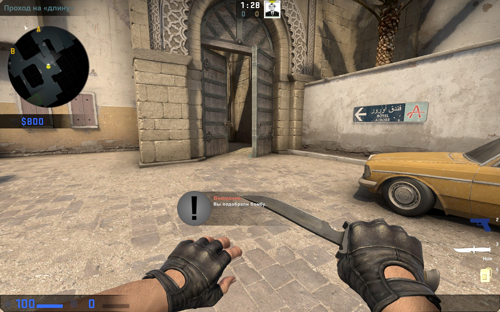
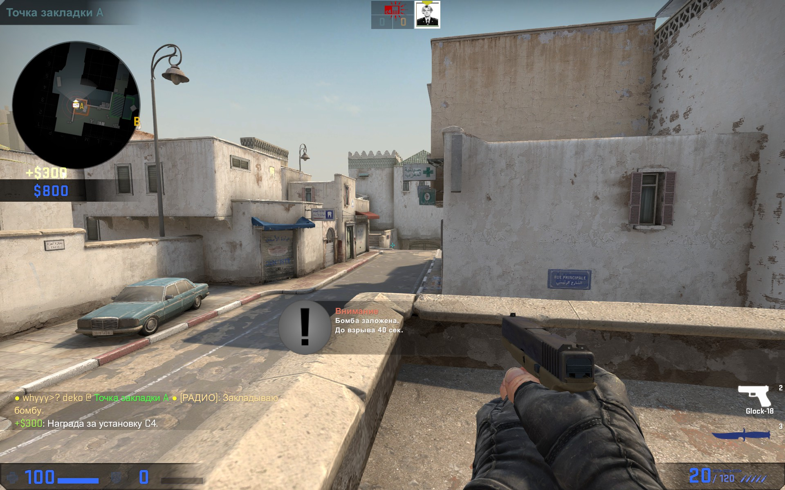

# ScaleformReborn
- This is a special modified Counter-Strike Global Offensive client, it returns to you that very particle of the old spirit of CSGO, but with the functions and capabilities of the CSGO_GC project (https://github.com/mikkokko/csgo_gc), but partially returns the old interface based on flash animations, namely scaleform ui, rejoice, be nostalgic and win with ScaleformReborn(THE PROJECT IS NOT BASED ON FLASH INTEGRATIONS!)

- The old spectator menu has also been returned, and the old radar view has been restored

- works as without skins...

- as well as their presence using csgo_gc

- full support for all colors, sizes, screen borders, and transparency,

- A full, restored version of the alert message
